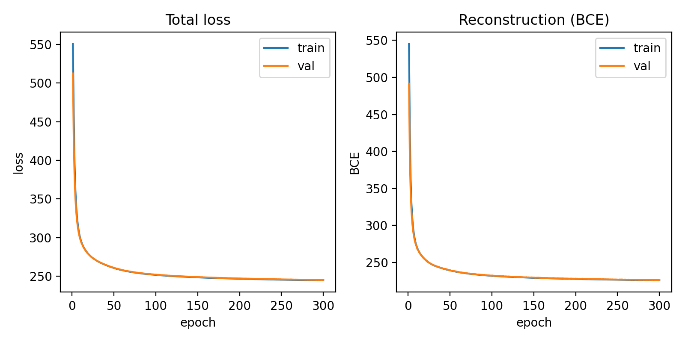
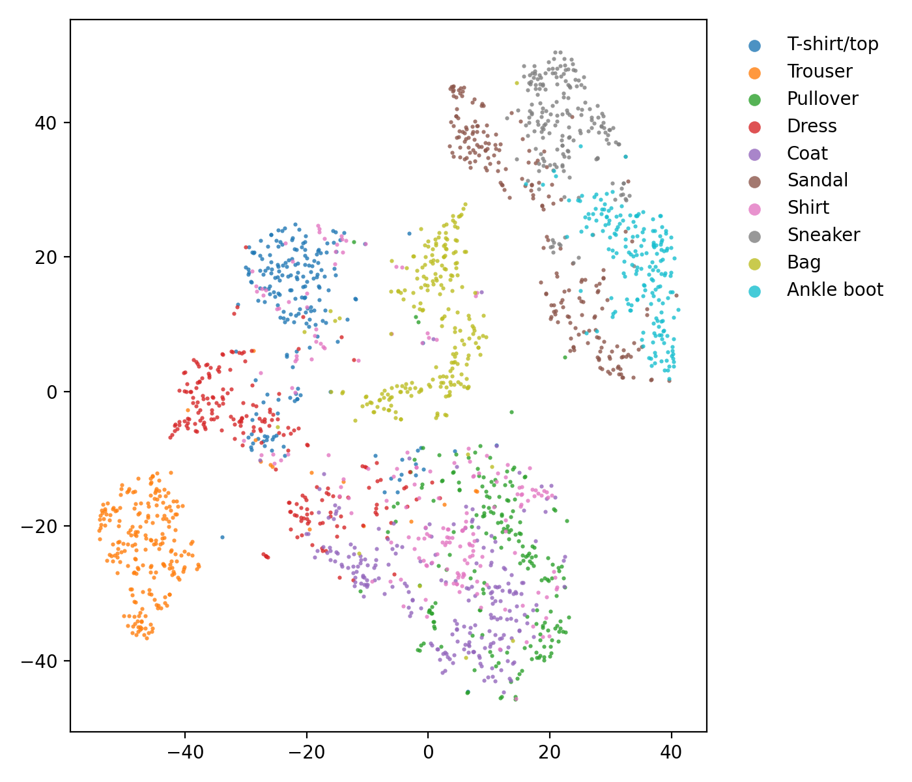

## Variationaler Autoencoder (VAE) für Bildgenerierung

Dieses Repository enthält die Umsetzung eines Variationalen Autoencoders (VAE) zur Generierung und Rekonstruktion von 28×28 Graustufenbildern. Standardmäßig wird der Fashion-MNIST Datensatz verwendet, optional kann auch MNIST genutzt werden.

### Datensatz
- **Standard**: Fashion-MNIST (`config.py → dataset = "fashion"`).
- **Alternativ**: MNIST (`"mnist"`).
- **Download**: Automatisch nach `outputs/data/`.

### Modellaufbau (Konzept)
Ein Variationaler Autoencoder besteht aus drei zentralen Bausteinen:

- **Encoder**: komprimiert ein Eingabebild in eine latente Repräsentation, die als Wahrscheinlichkeitsverteilung (Mittelwert und Streuung einer multivariaten Normalverteilung) parametrisiert wird.
- **Reparametrisierungstrick**: erlaubt das stochastische Ziehen eines latenten Vektors $z$ aus dieser Verteilung, während Gradienten für das Lernen weiterhin fließen können.
- **Decoder**: rekonstruiert aus $z$ wieder ein Bild. Durch Ziehen von $z \sim \mathcal{N}(0, I)$ können neue, zuvor ungesehene Bilder generiert werden.

Das Lernziel balanciert zwei Komponenten: einen **Rekonstruktionsfehler** (Bildtreue) und eine **Regularisierung des latenten Raums** (KL-Divergenz zur Standardnormalverteilung). Der Faktor $\beta$ steuert diesen Kompromiss. Ein gut strukturierter latenter Raum führt dazu, dass ähnliche Bilder nahe beieinander liegen und Interpolationen zwischen Punkten glatte, semantisch sinnvolle Übergänge ergeben.

### Installation und Ausführung
Voraussetzungen: Python 3.11+

```powershell
# Abhängigkeiten installieren
pip install -r requirements.txt

# Training starten
python vae.py
```

### Konfiguration
Die wichtigsten Einstellungen befinden sich in `config.py`:

```python
# Daten und Training
dataset = "fashion"      # "mnist" oder "fashion"
epochs = 200
batch_size = 128
lr = 1e-3
z_dim = 32
beta = 1.0
seed = 42
patience = 5              # Early Stopping
out = "outputs"           # Ausgabeverzeichnis
num_workers = 0           # Windows-kompatibel
```

### Ausgaben
Während und nach dem Training werden Visualisierungen im jeweiligen Runverzeichnis gespeichert:

- `outputs/fashion_z32_beta1_YYYYMMDD-HHMMSS/`
  - `..._orig.png` und `..._reco.png`: Raster der originalen und rekonstruierten Bilder
  - `..._orig_reco_side_by_side.png`: Original vs. Rekonstruktion nebeneinander
  - `..._interp.png`: lineare latente Interpolation zwischen zwei Bildern
  - `..._tsne.png`: t-SNE-Projektion der latenten Mittelwerte
  - `..._curves.png`: Trainings-/Validierungskurven

### Ergebnisse
Beispielgrafiken (entsprechen den automatisch erzeugten Dateien mit der Konfiguration `epochs=300`, `batch_size=128`, `lr=1e-5`, `z_dim=32`, `beta=1.0`) finden sich in dem Ordner `resources/` wieder:

**Originale vs. Rekonstruktion**

  

**Latente Interpolation**

  

**Lernkurven**

  

**t-SNE des latenten Raums**

  

### Reproduzierbarkeit
- Fester Zufallsseed für Python, NumPy und PyTorch
- Konstanter Train/Val-Split über denselben seed
- Early Stopping wenn nach einer bestimmten Anzahl aufeinanderfolgenden Epochen keine Verbesserung zu verzeichnen ist

### Projektstruktur
```
VAE-Training/
  vae.py           # Trainings- und Evaluationsskript
  config.py        # Konfiguration
  requirements.txt # Python-Abhängigkeiten
  resources/       # Beispielgrafiken für README
  outputs/         # Daten-Cache und Visualisierungen
```